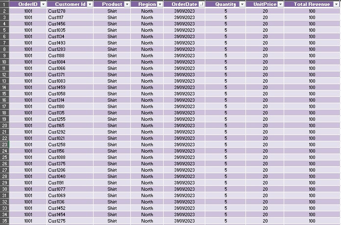
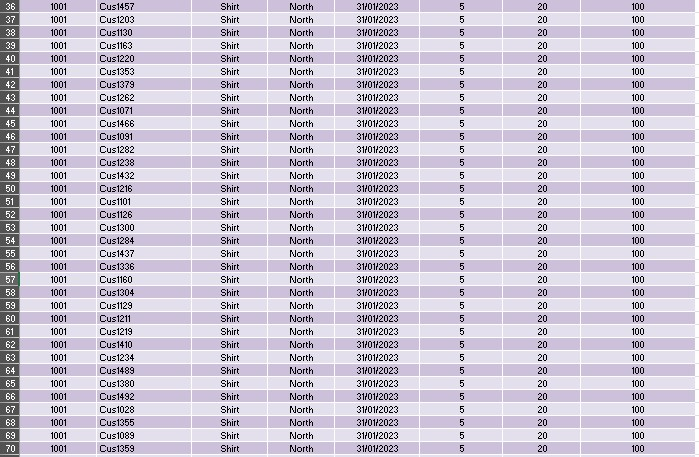
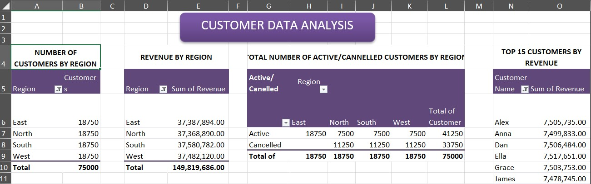
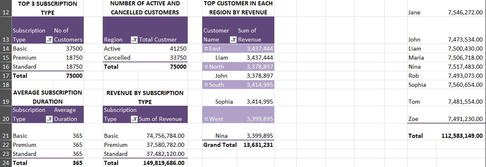
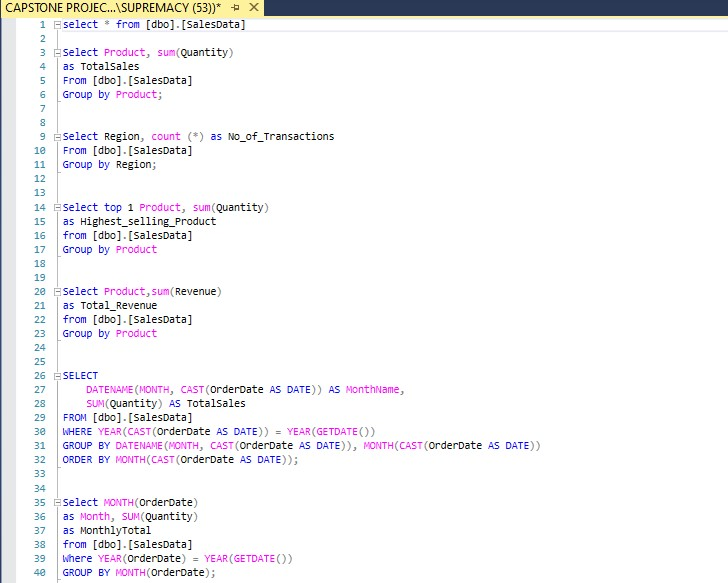
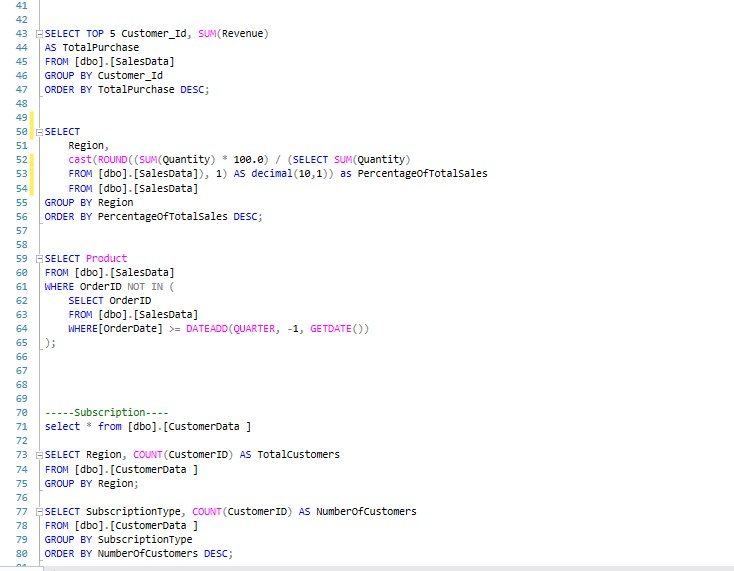
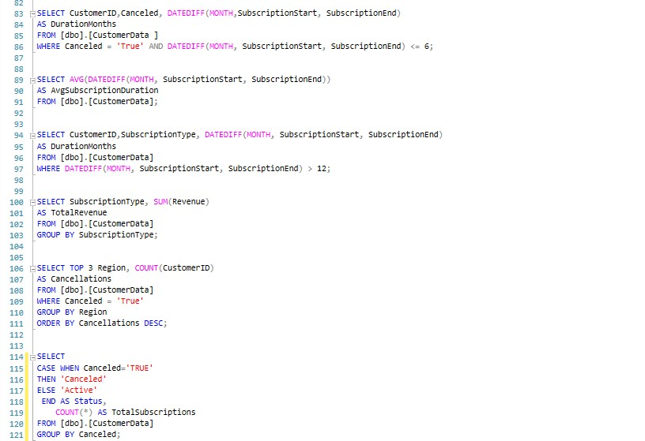
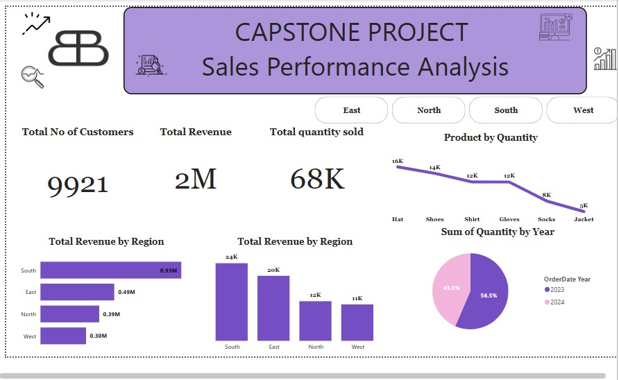

# LITA_CAPSTONE-PROJECT
# Capstone Project: Data Analysis and Visualization with Excel, SQL, and Power BI

This repository showcases the capstone project, which leverages data analysis and visualization skills using Excel, SQL, and Power BI. The project explores trends, segments, and patterns within customer and sales data to provide actionable insights.
Capstone Project is divide into Sales Data and Customer Data, both will be showcased in this repository 

## Table of Contents
1. [Project Overview](#project-overview)
2. [Tools and Technologies](#tools-and-technologies)
3. [Data Analysis](#data-analysis)
   - [Excel Analysis](#excel-analysis)
   - [SQL Queries](#sql-queries)
   - [Power BI Visualizations](#power-bi-visualizations)
4. [Insights and Findings](#insights-and-findings)
5. [Conclusion](#conclusion)

---

## Project Overview

This project aims to perform an in-depth analysis of customer and sales data for a subscription-based service. By using a combination of Excel, SQL, and Power BI, the analysis reveals insights into customer behavior, subscription trends, sales performance, and more.

## Tools and Technologies

- **Excel**: Used for initial data cleaning, exploratory data analysis, and basic visualizations.
- **SQL**: Employed to extract, transform, and aggregate data for more complex queries.
- **Power BI**: Used for creating interactive dashboards to visualize insights and trends.

---

## Data Analysis

### Excel Analysis

In this section, we performed preliminary data analysis, cleaned the raw data, and explored initial trends. Excel was also used to create basic charts and pivot tables to summarize key metrics.

### SQL Queries

Using SQL, we queried the data to retrieve detailed insights into customer behavior, subscription trends, and sales performance. SQL allowed for efficient data extraction and transformation, especially with large datasets.

### Power BI Visualizations

With Power BI, we built interactive dashboards that visualize key insights, such as top-selling products, customer demographics, subscription renewal rates, and regional performance. These visualizations provide a clear overview for stakeholders.

---

## Insights and Findings

- **Customer Segmentation**: Identified key customer segments based on demographics and subscription type.
- **Sales Trends**: Observed monthly and regional sales trends, with insights into the highest-performing products.
- **Subscription Behavior**: Analyzed renewal and cancellation rates, identifying factors influencing customer retention.

---

## Conclusion

The capstone project demonstrates proficiency in data analysis and visualization using Excel, SQL, and Power BI. The insights derived from this analysis provide valuable information for business decision-making, helping to improve customer retention and increase sales performance.

---

Feel free to explore the screenshots and insights provided in each section to get a comprehensive understanding of the analysis process and findings.
